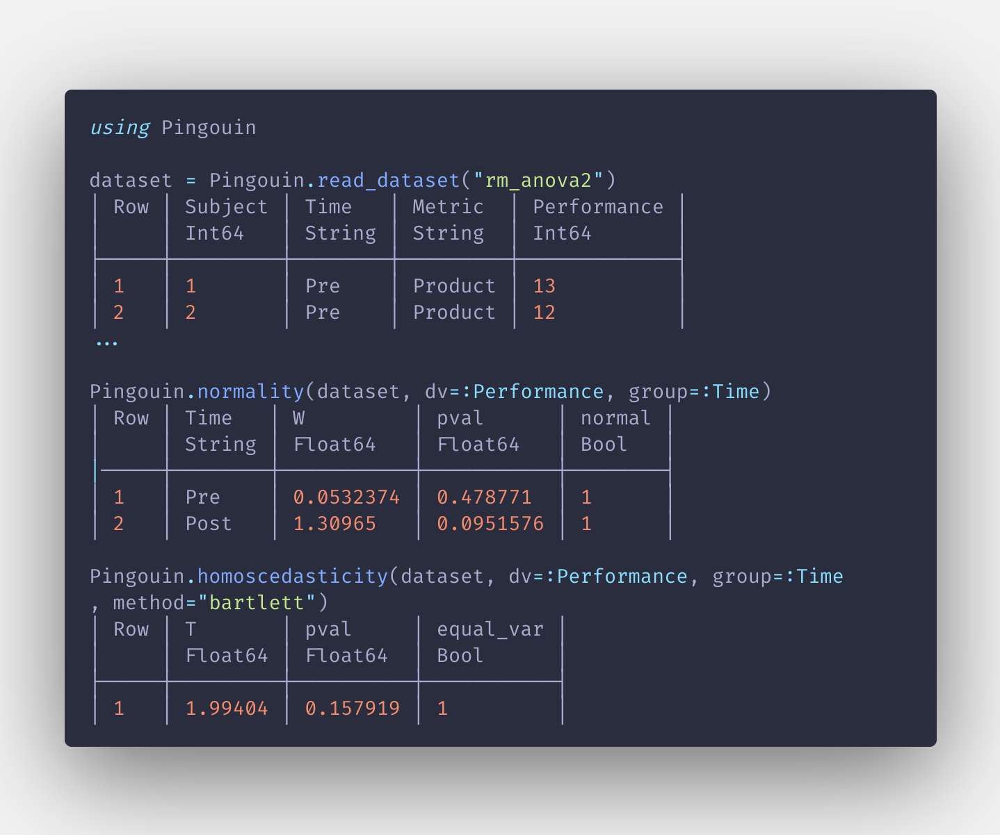

# Pingouin.jl

[Documentation](https://clementpoiret.github.io/Pingouin.jl/index.html)

Pingouin is designed for users who want simple yet exhaustive stats functions:


*A reimplementation of Raphaelvallat's Pingouin in Julia, from scratch.
Currently at a really early stage, usable, but please double check your results.*

I'm a PhD student who has to do statistical analysis. I'm also interested in
Julia. To learn Julia, I decided to reimplement my favorite stats lib I used in
Python. I'm starting with the functions I use the most, and simple statistical
tests. I'm open to every suggestions/contributions :)

I'm just starting in Julia, so if you find my code ugly, of if you want to suggest
some good practices, feel free to open an issue <3

Pingouin.jl is an open-source statistical package written in pure Julia,
and based mostly on DataFrames.jl, and HypothesisTests.jl. Some of its main
features are listed below. For a full list of future functions, please refer
to the original Python API documentation.

## Installation

You can install the latest table Pingouin through the official repo:

```julia
julia> using Pkg
julia> Pkg.add("Pingouin")
```

Or the latest version (maybe unstable) from github:

```julia
pkg> add https://github.com/clementpoiret/Pingouin.jl.git
```

## Current progress

- [x] Distribution,
- [x] Effect sizes,
- [x] Bayesian,
- [x] Non-parametric,
- [ ] **Correlation and regression [WIP]**,
- [ ] ANOVA and T-test,
- [ ] Multiple comparisons and post-hoc tests,
- [ ] Circular,
- [ ] Contingency,
- [ ] Multivariate tests,
- [ ] Plotting,
- [ ] Power analysis,
- [ ] Reliability and consistency,
- [ ] Others.

____
_shapiro.jl is provided under MIT license.
